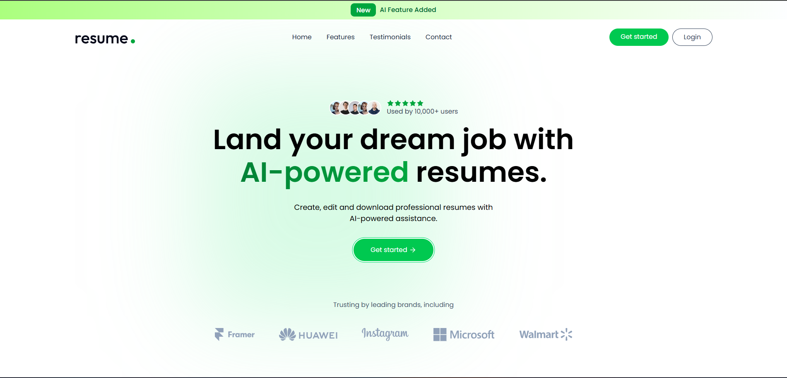
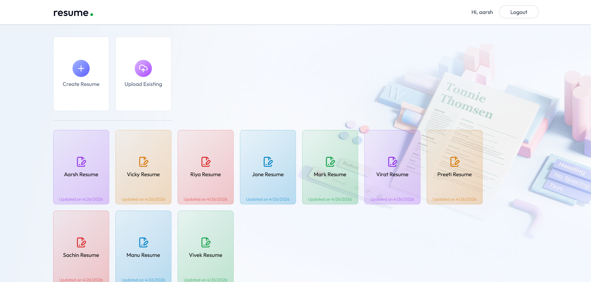
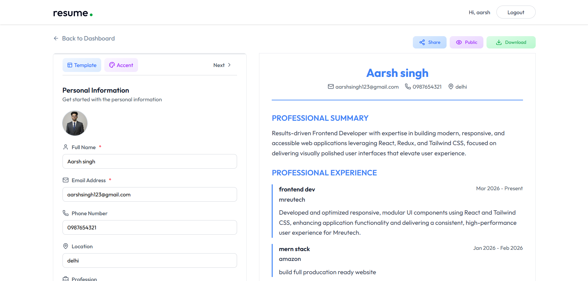
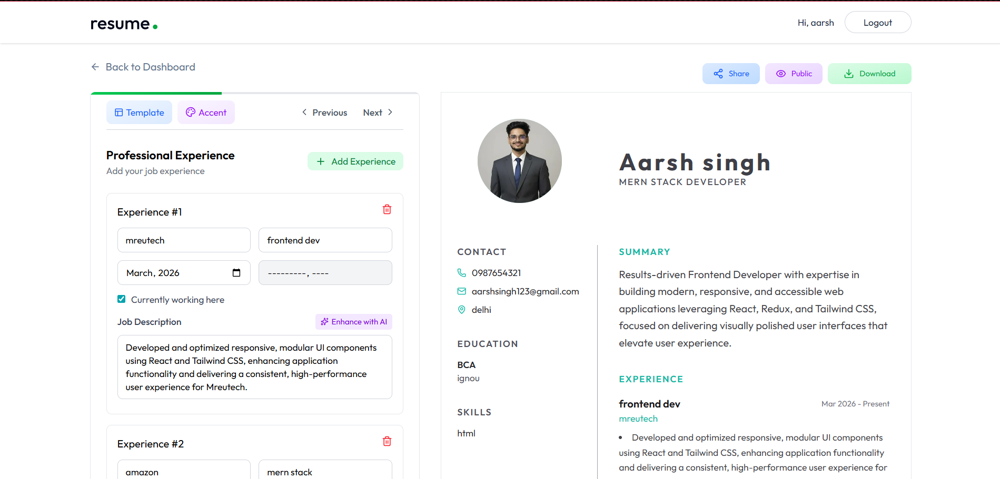
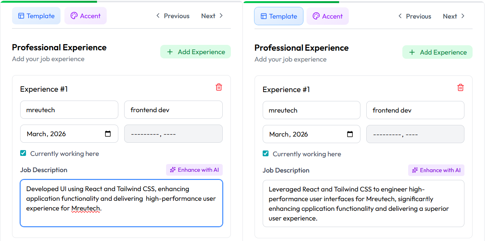

# 🚀 AI-Powered Resume Builder Platform


- Built a production-oriented full-stack resume builder for real-world usage  
- Enabled users to create, edit, and manage professional resumes seamlessly  
- Integrated AI-powered workflows for resume parsing and ATS-optimized content generation  
- Designed dynamic, customizable templates with real-time preview support  
- Implemented resume sharing and export features for practical usability

> ⚠️ AI features may be temporarily unavailable due to API quota limits. The system is fully implemented and functional with valid API access.

---

## 🌐 Live Demo

👉 https://aarsh-resume-builder.vercel.app/

---

## ✨ Why This Project Stands Out

- Combines **AI + file processing + full-stack CRUD** in a real-world product
- Implements **PDF → structured data pipeline using AI**
- Demonstrates **end-to-end ownership (UI → API → DB → AI layer)**
- Handles real-world problems:
  - Multipart data handling (image + JSON)
  - State synchronization across multiple sections
  - AI response parsing & validation
  - Public/private data access control

---

## 🧠 Core Features

### 🔐 Authentication & Access Control
- JWT-based authentication
- Protected routes and user-specific data isolation
- Public/private resume visibility system

---

### 📝 Resume Builder System
- Multi-section guided editor:
  - Personal Info  
  - Summary  
  - Experience  
  - Education  
  - Projects  
  - Skills  
- Template selection & accent color customization  
- Real-time preview synchronization  
- Save/update via FormData  

---

### 🤖 AI Integration (Key Feature)
- AI-powered **professional summary enhancement**
- AI-powered **job description rewriting**
- AI-based resume ingestion:
  - Upload PDF → extract text → process via AI  
  - Convert unstructured resume → structured JSON  

---

### 📄 PDF to Structured Data Pipeline
- Text extraction using `react-pdftotext`
- OpenAI JSON response formatting
- Direct mapping into database schema

---

### 🖼️ Image Processing
- Profile image upload via Multer
- ImageKit integration for storage & optimization
- Optional background removal transformation

---

### 🌍 Sharing & Export
- Public resume links
- Read-only public preview
- Print-based PDF download

---

## 📸 Screenshots

A quick walkthrough of the core user journey and key features of the platform:

---

### 🌐 Landing Page
<p align="center">
  
</p>

> Clean and modern landing page showcasing the product value — AI-powered resume creation with strong visual hierarchy and CTA-driven design.

---

### 📊 Dashboard (Resume Management)
<p align="center">
  
</p>

> Central dashboard for managing resumes with full CRUD functionality — create, upload, edit, and organize resumes efficiently.

---

### 🛠️ Resume Builder — Personal Info Section
<p align="center">
  
</p>

> Dynamic form-based resume builder with real-time preview synchronization and structured data input.

---

### 💼 Resume Builder — Experience Section (Template Variation)
<p align="center">
  
</p>

> Demonstrates complex form handling for experience entries along with template switching and accent color customization.

---

### 🤖 AI Enhancement (Before vs After)
<p align="center">
  
</p>

> Showcases AI-powered content improvement — transforming basic job descriptions into optimized, professional, and ATS-friendly content.

---

## 🛠️ Tech Stack

### Frontend
- React 19  
- Vite  
- Tailwind CSS  
- Redux Toolkit  
- React Router  
- Axios  
- React Hot Toast  

---

### Backend
- Node.js + Express  
- MongoDB + Mongoose  
- JWT Authentication  
- OpenAI SDK  
- Multer  
- ImageKit  

---

## 🏗️ System Architecture

Client (React + Redux)<br/>
↓ <br/>
API Layer (Axios + Auth)<br/>
↓ <br/>
Express Routes <br/>
↓ <br/>
Controllers (Business Logic)<br/>
↓ <br/>
MongoDB (User + Resume Data)<br/>
↓ <br/>
AI Layer (OpenAI Processing)<br/>
↓ <br/>
Media Layer (ImageKit)

---

## 🚧 Future Improvements

- Server-side PDF generation (instead of print)
- Autosave with debouncing & optimistic UI
- Real-time collaboration (shared editing)
- ATS scoring system
- Redis caching for performance
- More resume templates & customization

---

## ⚡ Challenges & Learnings

### 🤖 AI Response Handling
Ensuring consistent JSON parsing from AI responses required validation and fallback handling.

---

### 📄 Resume Parsing
Transforming unstructured resume text into structured schema highlighted real-world data inconsistency challenges.

---

### 🔄 State Management
Managing multiple resume sections with real-time preview required careful state synchronization.

---

### 🖼️ File + Data Handling
Handling multipart requests (image + JSON) and syncing them correctly with DB updates was non-trivial.

---

### 🔐 Auth & Data Isolation
Designing APIs to securely isolate user data while supporting public sharing.

---

### 🐛 Debugging Real Issues
- File upload inconsistencies  
- AI response failures  

---

## 📦 Project Structure

```text
Resume-Builder/
├── client/
│ ├── src/
│ │ ├── components/
│ │ ├── pages/
│ │ ├── configs/
│ │ └── App.jsx
│
├── server/
│ ├── controllers/
│ ├── models/
│ ├── routes/
│ ├── middleware/
│ └── server.js
